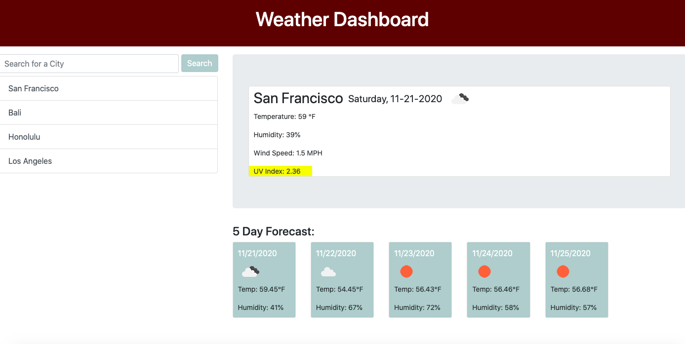
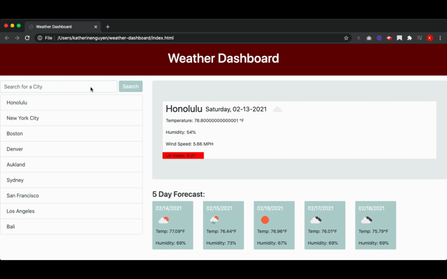

# weather-dashboard

## Description

For this application, users are able to type in a city to retrieve weather data, including current weather and 5 Day Forecast (powered by OpenWeather API). The current weather will display city name, the date, an icon representation of weather conditions, the temperature, the humidity, the wind speed and the UV index. Each search is saved to the local storage and displayed on the page. If a user clicks on a previous search, they will be able to retrieve the weather data for that particular city again.

## Usage

## License

[OpenWeather API](https://openweathermap.org/api)

## Links

[Weather Dashboard](https://katnguyenn.github.io/weather-dashboard/index.html)

[LinkedIn](https://www.linkedin.com/in/katherine-nguyen-205a7b13a/)